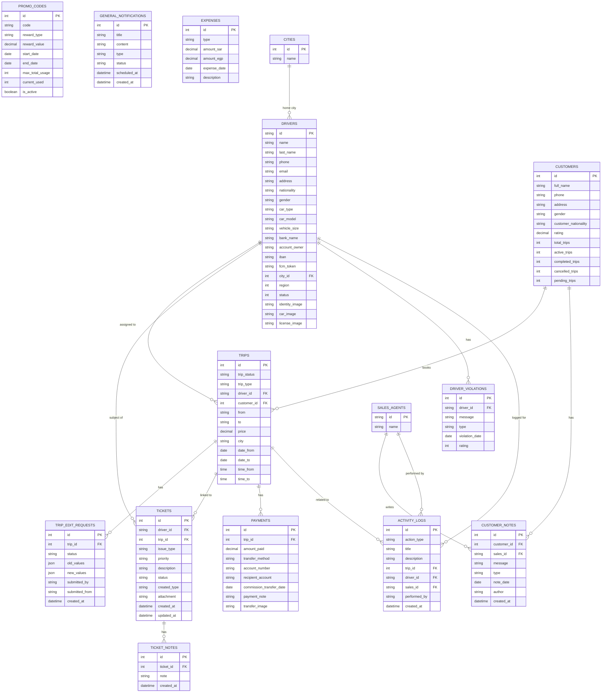

# Entity-Relationship Diagram

## Notes
This ER diagram is **inferred** from API request/response shapes observed in the frontend source code. The actual backend schema may differ. Relationships marked with `?` are assumed based on context.

---

## Mermaid ER Diagram



---

## Relationship Summary

| From | To | Type | Notes |
|---|---|---|---|
| `DRIVERS` | `TRIPS` | One-to-Many | A driver can have many assigned trips |
| `CUSTOMERS` | `TRIPS` | One-to-Many | A customer can book many trips |
| `TRIPS` | `TRIP_EDIT_REQUESTS` | One-to-Many | A trip can have multiple edit requests |
| `TRIPS` | `TICKETS` | One-to-Many | A trip can have multiple support tickets |
| `DRIVERS` | `TICKETS` | One-to-Many | A driver can be the subject of multiple tickets |
| `TICKETS` | `TICKET_NOTES` | One-to-Many | A ticket can have multiple notes |
| `DRIVERS` | `DRIVER_VIOLATIONS` | One-to-Many | A driver can have multiple violation records |
| `CUSTOMERS` | `CUSTOMER_NOTES` | One-to-Many | A customer can have multiple internal notes |
| `SALES_AGENTS` | `CUSTOMER_NOTES` | One-to-Many | A sales agent can write notes on multiple customers |
| `CITIES` | `DRIVERS` | One-to-Many | A city can have many drivers |
| `TRIPS` | `PAYMENTS` | One-to-Many | A trip can have multiple payment installments |
| `DRIVERS` | `ACTIVITY_LOGS` | One-to-Many | Driver actions are logged |
| `SALES_AGENTS` | `ACTIVITY_LOGS` | One-to-Many | Sales agent actions are logged |
| `TRIPS` | `ACTIVITY_LOGS` | One-to-Many | Trip-related events are logged |

---

## Firestore Data Model (Separate from Backend DB)

```
Firestore Database
└── notifications (collection)
    └── {docId} (document)
        ├── title: string
        ├── body: string
        ├── driverId: string
        ├── type: "driver" | "system"
        ├── read: boolean
        └── createdAt: Timestamp
```

The Firestore `notifications` collection is a **sync cache** of backend notifications plus any notifications sent directly from this admin dashboard. It is not the authoritative source — the backend is.
